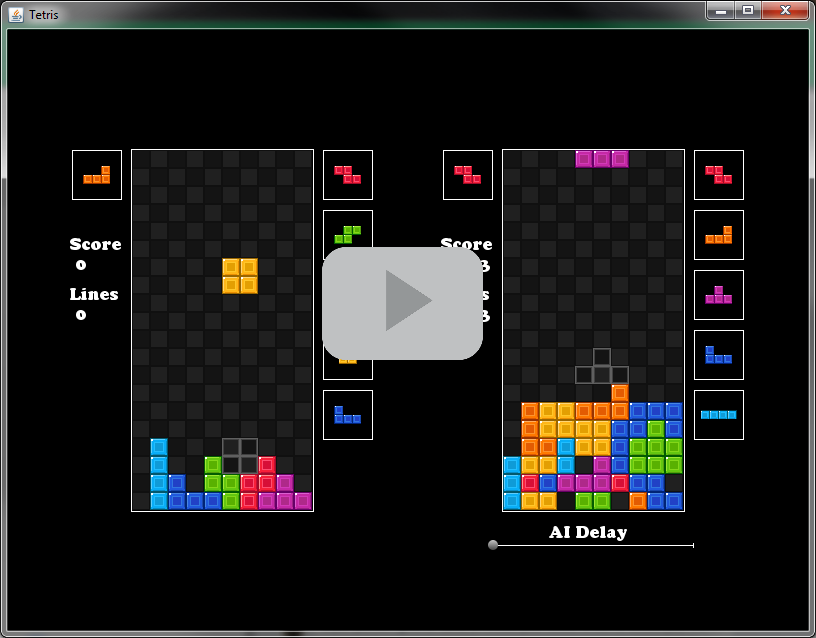

# Tetris AI #

This repository includes a pretty cool Tetris AI I wrote some time in high school. It isn't anything overly fancy, but it does the trick. The AI is built on top of the ITetris interface, which defines a playable tetris game implemented by TetrisImpl. There is also TetrisGraphics, which draws the ITetris instance using java.awt. To top it off, the demo also plays a midi file (The easiest way I could find to play music in Java without importing a library). 

## Screenshot ##

## Video ##

## Algorithm ##

The algorithm is very simple, it uses a score-based approach with a small number of parameters. I designed it to play the way I do, which is apparently alright. The scoring code is in TetrisBot.calculateBoardScore(). In order to decide on the next move, the AI scores all valid placements of the current piece or the piece that can be swapped from the hold position.

Scoring is based on the following ideas:
* Clearing lines is good
* Clearing tetrises is even better (4 lines at once)
* It is possible to eliminate the entire piece being placed by clearing lines, and that is a wonderful move if available
* Pieces should be placed so that they share as many edges as possible with the current stack.
* Placing pieces near walls is a good thing too
* Piece placement should prefer lower positions on the stack
* It is very bad to place a piece so that it creates a "shadow"
* Likewise, it is bad to cover up bubbles in the stack below the newly placed piece. (Doing so makes it harder to access and break the lines containing these bubbles)
* Leaving "cliffs" of greater than 1 tile next to the newly placed piece is bad, as it creates a need for an L, J or I piece.

All of the above heuristics came from my own observations as I played. The numberical weights to each of these heuristics came from experimentation. The heuristics also change subject to a few conditions.

### Additional Conditions ###

* If the stack is relatively short, the bot avoids placing pieces in the left-most column, this helps to build up possible tetrises.
* If there are a large number of bubbles in the stack, shadows become even more penalized and row clears gain a great significance. This change allows the AI to try to clear some of the excessive number of bubbles.
* If the stack height is too large and a tetris score is not coming soon (I piece in the next 5 pieces), then the AI stops prioritizing tetris scores and works to clear as many lines as possible.

## Code Style Note ##

I cleaned up the code a bunch since I originally wrote it. The original wasn't terribly ugly, but it didn't live up to my current code quality standards. The refactoring hopefully made the code pretty clear and easy to follow, however the calculateBoardScore method is pretty much unchanged from its original state, so it is a bit messy. One of the most important edits I made was to update the graphics system, which was pretty terrible in its original form. The new code has a healthy separation of graphics and state.

